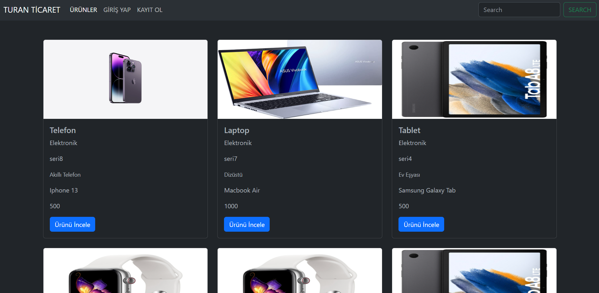
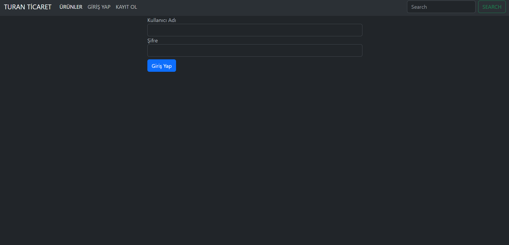
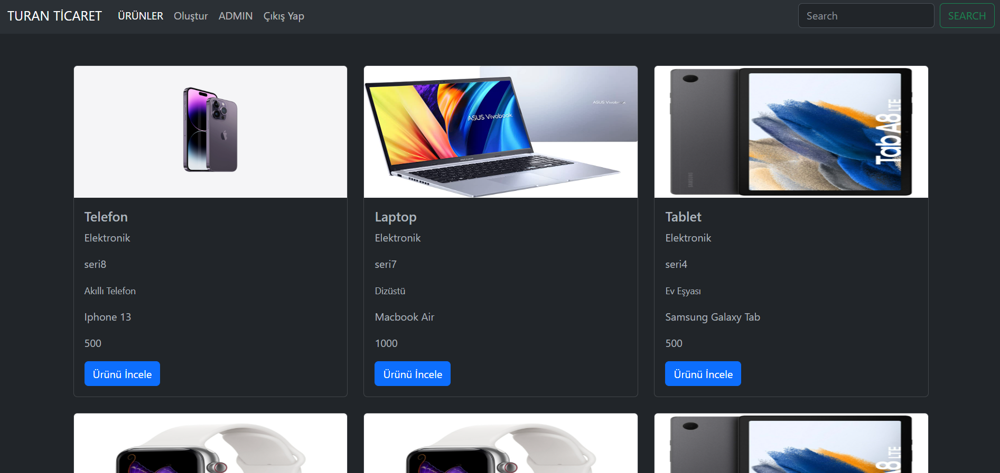
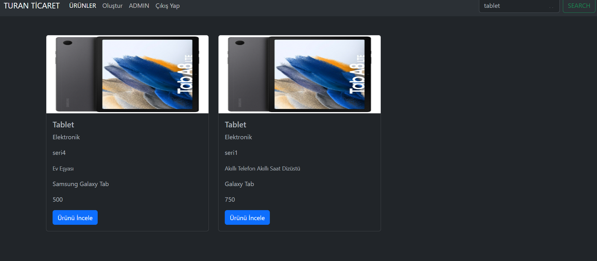
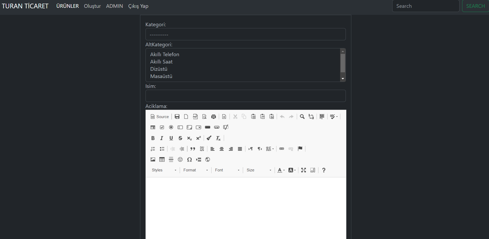
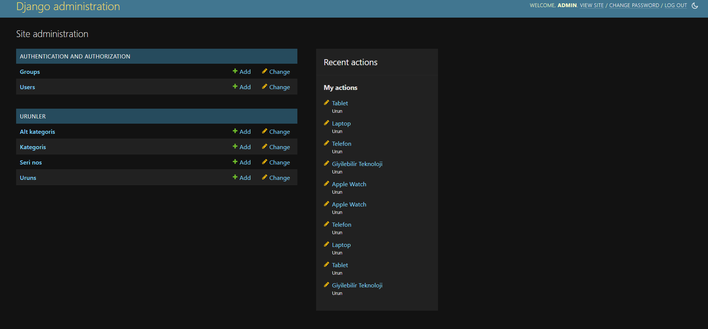

# An e-commerce web application that includes all front-end and back-end parts

# EXPLANATION

In this project, the user can register, log in, create and add products to the page if authorized, search and filter products on the page, go to the payment screen and pay the price of the products they add to their cart.

# Bootstrapt-Python-Django

# images from the project

